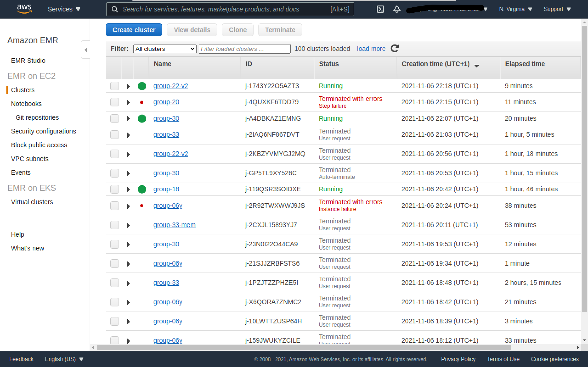
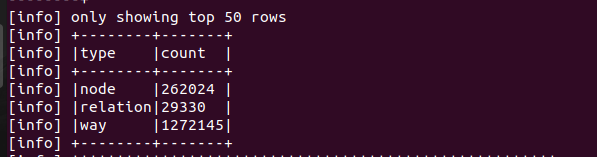
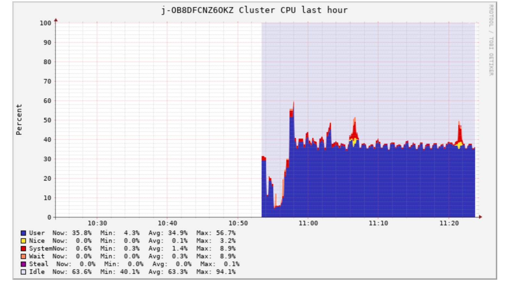
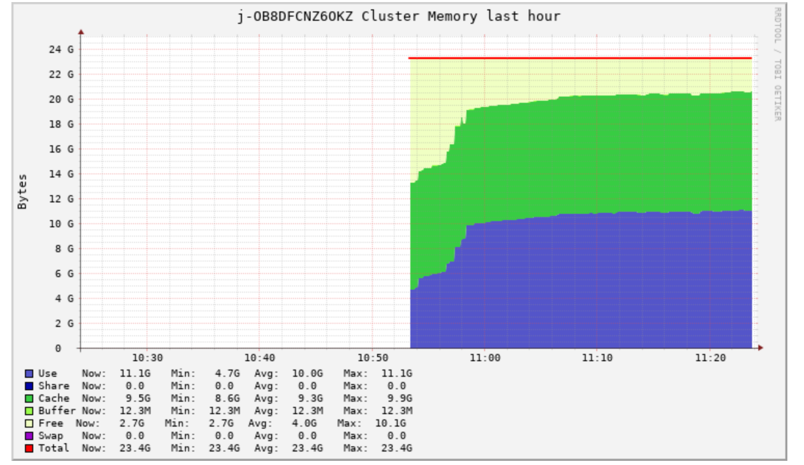
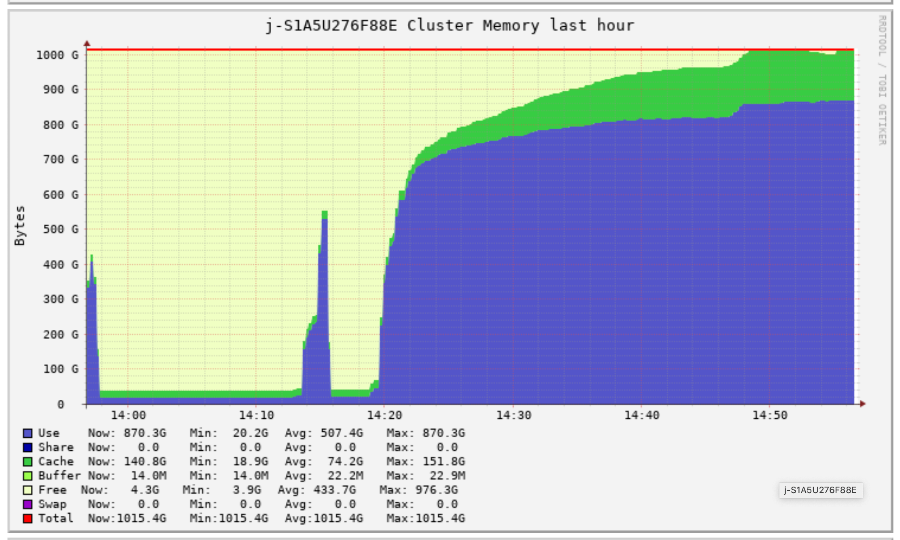
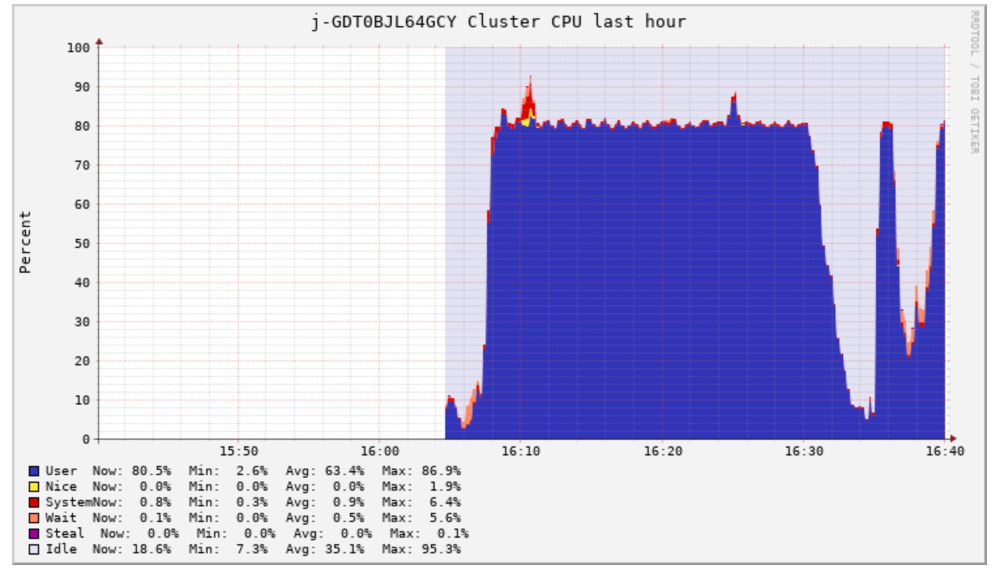
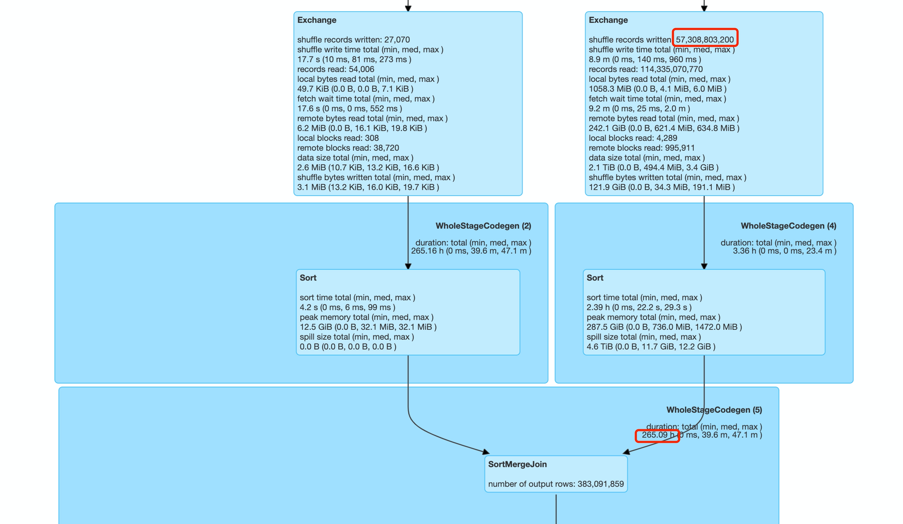
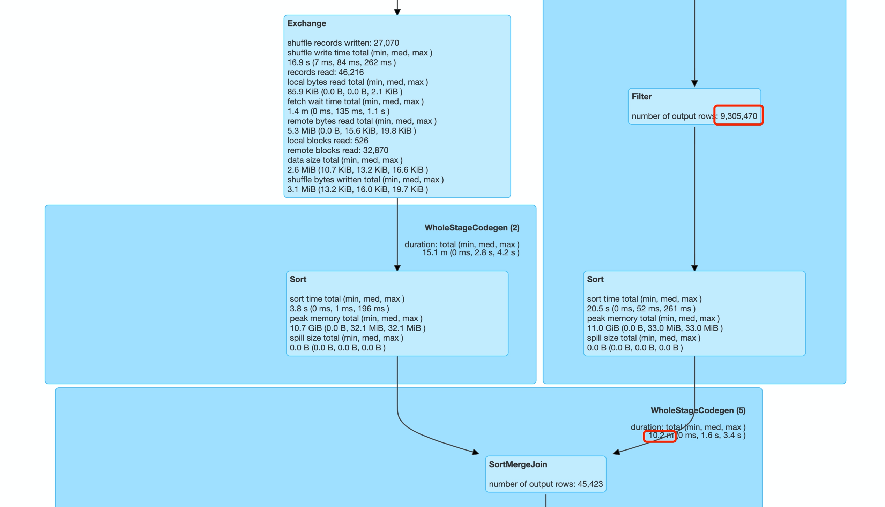
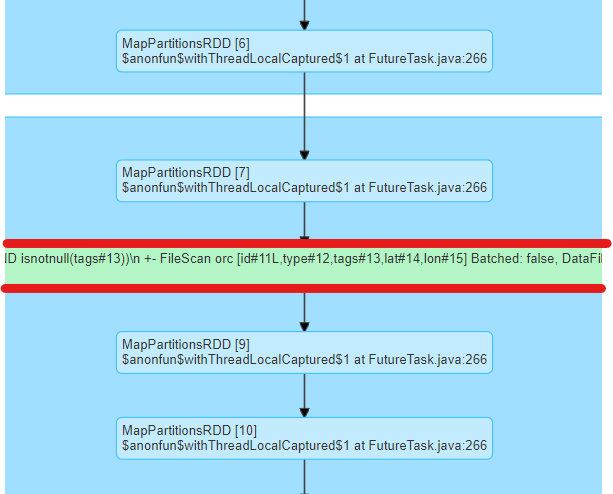

# Lab 2 Report

## Usage

The application is executed via `Planet.jar` , a fat JAR file packaged by the [sbt-assembly](https://github.com/sbt/sbt-assembly) plugin. First log in to your AWS account. 

Then it will come to the AWS management console, from which customers can get access to a variety of services that AWS provides. The one we use to run our Spark application is Elastic MapReduce(EMR). Type `EMR` in the search bar and click the link to the first result. Here, we can run our application in Spark cluster mode. 

<p align="center">

</p> 
<h6 align="center">EMR clusters interface</h6>


To create a cluster, the types and numbers of node instances we used to run our application on the Planet data set is listed below:
|Node type|Instance Type| Number of instances |
|:---:|:---:|:---:|
|Master node|c5.2xlarge |1|
|Core node|c5.24xlarge|4|

The final step is to add a step to the cluster. Choose Spark application as "Step type". Copy and paste the following configures into the "Spark-submit options" part. Select "Application location" from the S3 bucket and add an integer in "Arguments" to represent the rising sea level. Click "Add" and it is all set! 

```
--conf "spark.sql.autoBroadcastJoinThreshold=-1"  
--conf "spark.sql.broadcastTimeout=36000" 
--conf "spark.yarn.am.waitTime=36000"
--conf "spark.yarn.maxAppAttempts=1" 
```
<p align="center">

</p> 
<h6 align="center"> Add a step to cluster </h6>


## Approach

### Iteration 0: Baseline
The metrics of Lab 1 are listed as follows:
|Metrics| Value |
|:---:|:---:|
| System                  | Laptop  |
| Workers                 | 1 | 
| Dataset                 | Netherlands | 
| Run time  | 20-22 minutes | 
  
### Iteration 1: Improving performance on reading data
By inspecting the spark history server, we found that the performance of our application is not optimal due to several reasons:
1. The process of reading data takes a very long period of time
2. Duplicated process of reading data
3. Lack of proper configuration setting
<p align="center">

</p> 
<h6 align="center"> Stage 1, 2 , 5 took up 99% of time consumption </h6>


Accordingly, we implemented the following optimization:
1. Filter out the unnecessary data immediately after reading the data. 
    <p align="center">
    
    </p> 
    <h6 align="center">   The type "relation" and "way" are useless! </h6>
2. Cache intermediate data. The dataframes that are used multiple times can be stored in memory to make the access time much shorter.
3. Add some configures through a trial-and-error process and others' experience. For example, set the partition number to 5 instead of the default 200.
 ```
val spark = SparkSession
      .builder()
      .appName("Lab 2")
      .config("spark.master", "local[*]")
      // use all the cores
      .config("spark.sql.broadcastTimeout", "600")
      // avoid time-out error
      .config("spark.io.compression.lz4.blockSize", "512kb")
      // decrease the size of the shuffle file by increasing the compressed size of the block
      .config("spark.shuffle.unsafe.file.output.buffer", "1mb")
      // controls the amount of buffering possible when merging files during shuffle operations
      .config("spark.shuffle.file.buffer", "1mb")
      // allows Spark to do more buffering before writing final map results to disk
      .config("spark.executor.memory", "2g")
      //Amount of memory to use per executor process, set higher if there is enough memory
      .config("spark.sql.shuffle.partitions", 5)
      //The default number of partitions to use when shuffling data for joins or aggregations, when run on local bare metal machine, this should be set to a small value
      .getOrCreate()
 ```

 After implementing this alternative, we re-ran the application, resulting in:
|Metrics| Value |
|:---:|:---:|
| System                  | Laptop  |
| Workers                 | 1 | 
| Dataset                 | Netherlands | 
| Run time  | 7-8 minutes | 

### Iteration 2: Improving Cluster Instances
Gained confidence from running our application locally, we decided to deploy it on AWS to process a larger data set. Here are the metrics of our first test:
|Metrics| Value |
|:---:|:---:|
| System                  | AWS   |
| Workers                 | 2     | 
| Dataset                 | France| 
| Run time  | 49 minutes          | 
| Master node instance | m4.large |
| Worker node instance | m4.large |
| total vCPU | 4 |
| total memory | 16 |

By inspecting the Spark history server and Ganglia, we found that the lack of parallelism is the mean reason that slows down the process.
 <p align="center">
    
     </p>
<h6 align="center"> Cluster CPU on Ganglia </h6>
    <p align="center">
    
    </p> 
<h6 align="center"> Cluster memory on Ganglia </h6>
    <p align="center">
     
     </p>
<h6 align="center"> Cluster aggregated load_one on Ganglia </h6>

Since our program is developed in a scalable fashion, with more virtual CPU cores added to the cluster, the time consumption should scale down significantly. So we chose two ` m4.4xlarge ` as our core instance nodes, the result is just as we expected:

|Metrics| Value |
|:---:|:---:|
| System                  | AWS   |
| Workers                 | 2     | 
| Dataset                 | France| 
| Run time  | 7 minutes          | 
| Master node instance | m4.4xlarge |
| Worker node instance | m4.4xlarge |
| total vCPU | 32 |
| total memory | 128 |

### Iteration 3: Deal with errors, reduce shuffle data, upgrade the cluster
When moving from a relatively small dataset to a massive dataset, the load on the cluster increases exponentially. This switch could reveal the potential bugs and the bottleneck of performance, which are not apparent when the dataset size is not sufficiently large.

Unexpected runtime errors occurred as we migrated our application to the North America data set. With the aid of the Spark history server and Ganglia graph, we managed to overcome them and improve the overall performance significantly. Finally, we upgraded the cluster nodes to Compute Optimized instances for better performance. The elaboration of a step-by-step decision-making process is listed below:

Here are the metrics of our first try:

 |Metrics | Value |
 |:---:|:---:|
 | Master Node               | m4.xlarge |
 | Core Node                 | m4.16xlarge|
 | Workers                   | 4 |
 | Spark-submit option       | --conf spark.sql.autoBroadcastJoinThreshold=-1 <br>--conf spark.sql.broadcastTimeout=36000 <br> --conf spark.yarn.am.waitTime=36000 <br> --conf spark.yarn.maxAppAttempts=1 |
 | Dataset                 | North America |
 | Run time <br>(hh:mm:ss) | N/A (fail with run-time error) |
 | total vCPU | 256 |
 | total memory | 1024 |

 
#### Dealing with run-time error 
The errors are fixed by adjusting the cluster setting and adding the following configures:
* `No-space left on device` error: Caused by limited disk storage of the cluster, we solved it by increasing the EBS storage of core node to 16000 GB and lowering the amount of data during shuffle operation, which will be mentioned in the next part.
* `Broadcast time-out'error: Broadcasting a gigantic dataset to each partition is not efficient and could cause time-out; it can be handled either 
  * by adding spark-submit option `--conf "spark.sql.autoBroadcastJoinThreshold=-1" `to disable broadcast, which is our final choice.
  * or by adding spark-submit option `--conf "spark.sql.broadcastTimeout=36000"` to increase the time-out to a rather large value, which is not preferable because it makes the time-consuming broadcast process undetectable.
  
* `DistanceUndefinedException`: this exception is thrown when the distance between two h3 points is too far to be calculated. It is handled by catching the exception and returning a negative value. The row with negative distance will be regarded as a "infinite" distance and thus be filtered out since it is not worth considering when choosing the closest refuge.


#### Memory and CPU usage
After handling the errors, a full application run can be completed on the cluster, whereas the elapsed time is relatively long (around `50min`).
By observing the Ganglia diagram:

<p float="left">


</p>
<h6 align="center"> Cluster data on Ganglia </h6>

<p align="center">
    
    </p>
<h6 align="center"> Memory spill in stage 3</h6>


It can be seen that memory usage has reached its limit, which can also be proved by a large amount of memory **spill**. A spill happens when a given partition can not fit into RAM. Consequently, Spark is forced into expensive disk reads and writes to free up local RAM to avoid the `Out of Memory` error, which can crash the application.

Instead of simply allocating more memory to Workers, we first tried to add some Spark configures to mitigate the problem. For example, increase the number of shuffle partitions to lower the amount of data in each partition. However, the effect is subtle. 

Thus, the only way to make a breakthrough is on the application level.  

#### Reducing shuffle cost
By observing the application DAG in spark-history server, 
<p align="center">

</p>
<h6 align="center"> DAG before reducing shuffle </h6>

The critical bottleneck happens in one of the `SortMergeJoin` steps, of which the summing execution time is 265.09 h. This operation corresponds to the `join()` operation between two dataframes read from OpenStreetMap and ALOS (`placeDF` and `elevationDF`). A large amount of data shuffle caused a remarkable time consumption. 

We come up with an alternative to mitigate the shuffle cost: by bringing forward the drop-duplicate operation of H3 values to an early stage to release the stress of the `join()` operation. 

In the original code, the `placeDF` and `elevationDF` are first combined into a joined dataframe, then grouped by "name" while only the minimum elevation for each place
is kept. These can be altered by removing the data with the same "H3" in `elevationDF` before `join()`, only keeping the minimum elevation for each H3 value. 
With this change, the amount of records entering `SortMergeJoin` is reduced significantly. 

<p align="center">

</p>
<h6 align="center"> DAG after reducing shuffle </h6>
                                                                                                                        
Running time has dropped sharply under the same configuration.
```
50min -> 15min
```

#### Migrating to a suitable instance type
Due to the reduction of shuffle operation, the memory for storing intermediate data of shuffle has decreased a lot. Thus, it is no longer the main limitation in performance. However, the CPU usage is still remarkable and probably the major barrier when further optimizing the run time. Since `m4.x16large` is already the most advanced instance type in m-type nodes, we migrated to `c5.x24large`, which has lower total memory but more vCPUs. The running time has decreased as we expected: 
```
15min -> 6min
```
#### result at the end of the iteration

|Metrics| Value |
|:---:|:---:|
| Master Node               | c5.2xlarge |
| Core Node                 | c5.24xlarge|
| Workers                   | 4 |
 | Spark-submit option       | --conf spark.sql.autoBroadcastJoinThreshold=-1 <br>--conf spark.sql.broadcastTimeout=36000 <br> --conf spark.yarn.am.waitTime=36000 <br> --conf spark.yarn.maxAppAttempts=1 |
| Dataset                 | North America |
| Run time  | 6 min |
| total vCPU | 384 |
| total memory | 192 |

### Iteration 4: Efforts made to improve performance on Global data set
We first deployed our application to the Europe data set with the same configurations. The result turned out to be very close to the North America data set.  
|Metrics| Value |
|:---:|:---:|
| Master Node               | c5.2xlarge |
| Core Node                 | c5.24xlarge|
| Workers                   | 4 |
 | Spark-submit option       | --conf spark.sql.autoBroadcastJoinThreshold=-1 <br>--conf spark.sql.broadcastTimeout=36000 <br> --conf spark.yarn.am.waitTime=36000 <br> --conf spark.yarn.maxAppAttempts=1 |
| Dataset                 | Europe |
| Run time  |  9 min |
| total vCPU | 384 |
| total memory | 192 |
|Creation date of cluster|2021-11-06 15:53(UTC+1) |

So we decided to switch to the Planet data set and got the following result:

|Metrics| Value |
|:---:|:---:|
| Master Node               | c5.2xlarge |
| Core Node                 | c5.24xlarge|
| Workers                   | 4 |
 | Spark-submit option       | --conf spark.sql.autoBroadcastJoinThreshold=-1 <br>--conf spark.sql.broadcastTimeout=36000 <br> --conf spark.yarn.am.waitTime=36000 <br> --conf spark.yarn.maxAppAttempts=1 |
| Dataset                 | Planet |
| Run time  | 1h 07min |
| total vCPU | 384 |
| total memory | 192 |
|Creation date of cluster|2021-11-06 15:53(UTC+1) |

To improve the performance, we implemented multiple methods from different aspects:

1. The bottleneck is obvious: The first shuffle operation after reading the parquet data.
    * Since we could not think of a way to minimize the amount of input data, we could only try to replace the `groupBy` operation with `Window` function. `Window` functions operate on a group of rows, referred to as a window, and calculate a return value for each row based on the group of rows. 
    * We implemented the same process with `Window` function. However the result didn't improve, and the performance got even worse. After analyzing the data from the Spark history server, we deduce that it is caused by a full shuffle in the `Window` function. While with `groupBy`, Spark will partly aggregate the data first and then shuffle the reduced dataset. A snippet of the code we used is below.
    ```
    import org.apache.spark.SparkConf
    import org.apache.spark.SparkContext
    import org.apache.spark.sql.expressions.Window
    import spark.implicits._
    val elevationSpecAgg = Window.partitionBy("H3")
    val elevationSpec = Window.partitionBy("H3").orderBy("H3")
    val elevationDF = elevationH3
    .withColumn("row",row_number.over(elevationSpec))
    .withColumn("min",min(col("H3")).over(elevationSpecAgg))
    .where(col("row")===1)
    .select("H3","elevation")
    ```
  
2. In the second most time-consuming stage, we deleted an unreasonable `persist` operation. It is unnecessary to store the data into memory here because the dataframe is not frequently used and is also too large to store in memory. Plus, it causes overhead during the serialization process.

<p align="center">
    
    </p>
<h6 align="center"> Unnecessary persist operation </h6>

3. Talking about serialization, we also tried to switch to the [Kryo](https://github.com/EsotericSoftware/kryo) serializer, which is about ten times faster and more compact than the default Java serializer according to the [Spark Tuning Guide](https://spark.apache.org/docs/latest/tuning.html#data-serialization). However, with the limited amount of time we have left, we did not successfully implement it. The `Lab2` case class in our modified program can not be registered in Kryo. A snippet of the code we used is below.

```
import org.apache.spark.SparkConf
import org.apache.spark.SparkContext

 val conf = new SparkConf()
    .setAppName("Lab 2")
    // .set("spark.kryo.registrationRequired", "true")
    .set("spark.serializer", "org.apache.spark.serializer.KryoSerializer")
    conf.registerKryoClasses(Array(classOf[Lab2], classOf[h3Helper]))
    val sparkContext = new SparkContext(conf)

    val spark = SparkSession
      .builder()
      .appName("Lab 2")
      .config(conf)
      .getOrCreate()
```
4. Tune the Spark configurations, including the number of shuffle partitions, cores per executor, memory fraction and etc. 
   * To maximize the parallelism of our spark application, a general rule given by the Spark guide is to set default. parallelism to 2-3 times the number of CPU cores. 
   * Assigning executors with many virtual cores leads to a low number of executors and reduced parallelism. Assigning a low number of virtual cores leads to a high number of executors, causing a more significant amount of I/O operations. A simple rule of thumb is to allocate five virtual cores for each executor.
   * The configures can be set in the application at runtime or in the application. The optimal configure requires a trial-and-error process to tune it for our specific application. With only a limited amount of credits, we decided that it is unnecessary to test each configure thoroughly to get the optimal configure. An example of configures setting on runtime is listed below.
```
--conf "spark.sql.autoBroadcastJoinThreshold=-1" 
--conf "spark.sql.broadcastTimeout=36000" 
--conf "spark.yarn.am.waitTime=36000"
--conf "spark.yarn.maxAppAttempts=1" 
--conf "spark.sql.shuffle.partitions=1188"
--conf "spark.serializer=org.apache.spark.serializer.KryoSerializer"
```

5. Change the algorithm of `joining` the flooded place dataframe to the safe city dataframe. 
   * The worst case scenario for the `joining` process is a [Cartesian product](https://en.wikipedia.org/wiki/Cartesian_product) which consequently produces a large dataframe with the number of rows equals to the multiplication of the number of rows in each dataframe. 
   * So, we implemented an operation based on H3's function `kRing`, which could return the H3 index of the neighboring tiles of a given `k` value. In this case, we can match the flooded place only to close safe cities instead of cities on the whole planet. And for the remainder that couldn't find a safe city nearby, we match it to all the safe cities by a `crossjoin` operation. A snippet of the code we used is below.
```
val closestHarbour_pre =
floodDF //join place and destination if there is an overlap in the H3RoughArray and floodH3Rough
 .join(
   harbourDF,
   arrays_overlap(col("floodH3Rough"), col("H3RoughArray")),
   "leftouter"
 ) //join by H3Rough
 .withColumn(
   "harbour_distance",
   distanceUDF(col("floodH3"), col("harbourH3"))
 )
 .drop("harbourH3", "floodH3", "floodH3Rough")
 .cache()// this DF will be used multiple times in the following process
```

6. Bucket the data by key before `SortMergeJoin` to avoid the expensive exchange operation. The result turns out to be worse since it requires much memory to cache the tables. Furthermore, the number of buckets needs to be judiciously selected. A snippet of the code we used is below.

```
placeDF
   .orderBy(asc("H3"))
   .write
   .format("parquet")
   .bucketBy(1188, "H3")
   .mode(SaveMode.Overwrite)
   .saveAsTable("placeTbl")
 val placeTblDF = spark.sql("CACHE TABLE placeTbl")
 ...
    val placeBucketDF = spark.table("placeTblDF")
    val elevationBucketDF = spark.table("elevationTblDF")
    val combinedDF = placeBucketDF
    .join(elevationBucketDF, Seq("H3"), "inner")
```

## Summary of application-level improvements

 
* Dropped redundant data before the shuffle stage to ease the memory pressure 
* Leveraged the Spark push down feature to reduce the amount of input data   
* Cached frequently used data
* Improve the matching algorithm when trying to find the closest refuge

## Cluster-level improvements


* Updated core node type to gain more cores and memory
* Switched to calculation-optimized instances to efficiently balance the cost and effect.
* Set Spark configures like the number of partitions, cores per executor.
* Disabled `BroadcastHashJoin` according to the scale of application

## Conclusion

In this lab, we learned about:
1. The underlying logic of running a Spark transformation/action, the dependencies of stages, and how to leverage them to improve the performance of our application.
2. The iteration development process for big data applications.
3. Utilization of Amazon Web Services for computation/memory-demanding applications. 
4. The usage of Spark monitoring tools (mainly about Spark history server, Ganglia), the analysis of its data, and graphs. 
