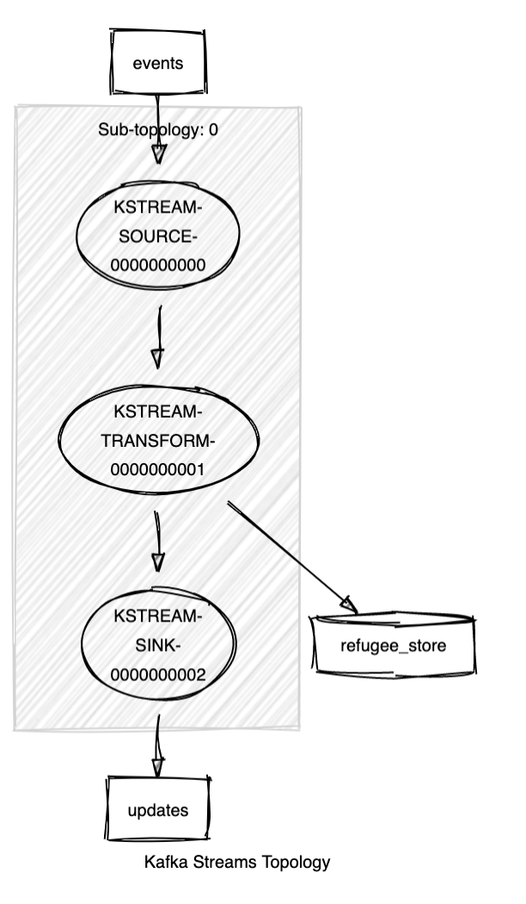
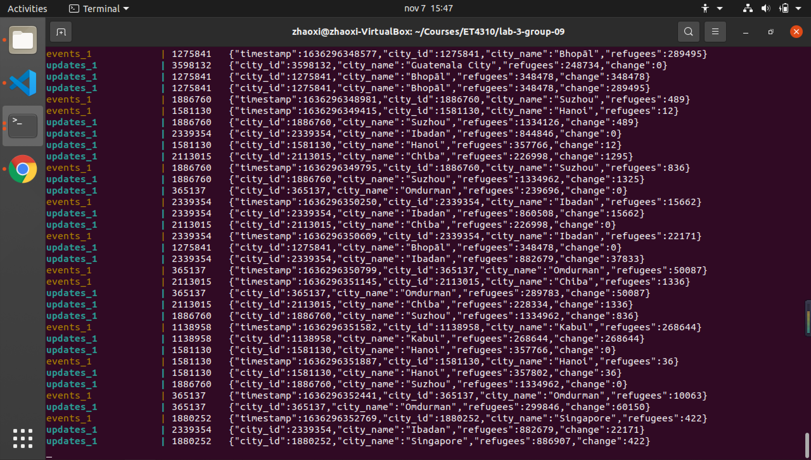

# Lab 3 Report


> "We are all passengers aboard one ship, the Earth, and we must not allow it to be wrecked. There will be no second Noah's Ark." <p align="right">---- Mikhail Sergeevich Gorbachev (1990)</p>

A Noah's Ark may not only be a legend in the bible. When the world is going to be devastated by flood, a modern Noah's Ark will be the final sanctuary of the human being.
As a high-tech armed shelter, the UM mothership releases an app that continuously receives the message of arrived refugees and generates the count of refugees in real-time.
Such streaming applications can be accomplished by the well-known framework Apache Kafka, which is able to process the streaming problem in a scalable fashion.

## Usage

The following library dependencies should be added to transformer/build.sbt:
```
libraryDependencies ++= Seq(
    "io.circe" %% "circe-core" % "0.14.1",
    "io.circe" %% "circe-generic" % "0.14.1",
    "io.circe" %% "circe-parser" % "0.14.1" ,
)
```

Open a terminal 1, git clone the project repo to /home, run `docker-compose up` in the project root directory. After all the servers be started up, open another terminal and run `docker-compose exec transformer sbt` under root directory.
to open interactive sbt terminal. When the producer starts to produce steady input stream in "events" topic like following:

```
events_1            | 1810821	{"timestamp":1634500171928,"city_id":1810821,"city_name":"Fuzhou","refugees":2953}
events_1            | 5506956	{"timestamp":1634500172053,"city_id":5506956,"city_name":"Las Vegas","refugees":99498}
events_1            | 1793505	{"timestamp":1634500172548,"city_id":1793505,"city_name":"Taizhou","refugees":12371}
events_1            | 1627896	{"timestamp":1634500172679,"city_id":1627896,"city_name":"Semarang","refugees":114243}
events_1            | 1258662	{"timestamp":1634500173010,"city_id":1258662,"city_name":"Rāmgundam","refugees":0}
```

compile the code:
```
sbt:Transformer> compile
```

run the transformer by passing command line argument: window size N (seconds).
Here the window size is set to 2 seconds. Note that the input argument should be a positive integer, otherwise
it will be rejected by the type-check procedure and the kafka context will be shut down
```
sbt:Transformer> run 2
```

The transformer will start to transform the input stream and write to output topic "updates".


## Functional overview

The formation of ideas, and the step-by-step build-up process of the kafka application are elaborated here:

### Step 1: Choosing proper tool 
Basically, there are two commonly used stream-processing tools in processor API,
namely the processor and transformer. There are so many resemblances between them —— Both of them consume records from input topic, transform the data with certain behavior patterns, and write the result to output topic; both of them can execute stateful operations when associated to StateStore. Nevertheless, to implement the application in a relatively natural way, we need to make a shrewd choice between them.
Our final choice is transformer. And the reasons are listed as below:
* As a built-in property, the transformer transforms every input record to an output record. While the processor does not necessarily output the transformed record. Thus, the transformer is a
  more suitable choice when it comes to the good requirement.  Using transformer can ensure that an output will be produced for each input, as it is the fundamental purpose of good-level requirements.
* Transformer is typically more suitable for processing single stream data than the processor. 

 
### Step 2: Build topology
* Source: The input stream is attained by specifying the input topic name when calling `builder.stream()`.
* Transform: The output stream is transformed from the input stream via `KStream.transform()` method, in which a new TransformerSupplier instance needs to be created.
* StateStore: StateStore is adhered when calling `KStream.transform()`.
* Sink: The name of the output topic is specified by calling `to()` method.

### Step 3: Define a transformer to sum refugees
To transform the input record to output record by accumulating the refugee number for each city, a transformer adhered by a kvStore is required.

 The transformer is formed by the following parts:
 * `init()`
   * get `refugee_store` from kafka context
   * read the timewindow size from the command line argument and check its validity
   
 * `transform()`
   * decode the input json string and transform it to case class; then read all the fields in case class
   * if it is the first arrival of a city, create new entry in kvStore
   * if the city has appeared before, retrieve its historical record in kvStore, add the newly arrived refugee to the old refugee count and update the entry in kvStore
   * return the newly updated record 

 * `close()`
   * clean up any resources by iteratively delete all the entries in kvStore


### Step 4: Keep track of the count change in time window 
To meet with the requirement for excellent level, the application should be able to keep track of an N-second time window.
So that it can output the change in refugee count within the time window. The update of count change should be written to output topic when a new record arrives as well as when an out-of-date
record is fading out of the time window. The output is separately produced from two sources: the update for newly arrived records, as the return value of `transform()`, is directly written to the `updates`
stream; while the update for out-of-date records is generated in a punctuator.

The punctuator is the essential element for implementing the time window. As soon as a new record enters `transform()`, the punctuator will be created and scheduled. Even when the `transform()` method exits, the punctuator continues to exist until it is triggered after the designated time window interval to accomplish the mission of generating the output updates. After that, the punctuator is no longer usable and thus be canceled.


The realization of punctuator is depicted in detail as below:  
<br/>

#### Create a punctuator for each input record
For each input record, a disposable punctuator is instantiated in the `transform()` method, where two steps need to be taken:
* sending information of the current record to the punctuator so that they can be well-saved in the punctuator's member variables. These variables can be utilized when the current record is about to slide out of the time window.
* schedule the punctuator, in which the `Duration` is specified by window size (unit: seconds). The `PunctuationType` need to be set to `WALL_CLOCK_TIME`, with which the `punctuate()` method
  will be triggered by the wall-clock time.
  <br/>

#### Calculate and produce the output record
After N seconds, the punctuator is triggered and will do the following things inside `punctuate()`:
* retrieve the information of the to-be-removed city in the kvStore
* read the to-be-removed refugee number from the class variable. Subtract it from the old `change` field in kvStore to get the new refugee count in the time window
* update the entry in kvStore and write to `updates` topic


## Kafka topology and setup


By calling topology.describe(), the topology description can be printed out:

```
Topologies:
   Sub-topology: 0
    Source: KSTREAM-SOURCE-0000000000 (topics: [events])
      --> KSTREAM-TRANSFORM-0000000001
    Processor: KSTREAM-TRANSFORM-0000000001 (stores: [refugee_store])
      --> KSTREAM-SINK-0000000002
      <-- KSTREAM-SOURCE-0000000000
    Sink: KSTREAM-SINK-0000000002 (topic: updates)
      <-- KSTREAM-TRANSFORM-0000000001
```

This can be converted to sketch diagram via visualizer tool:

<p align="center">

</p>

<h6 align="center "> Sketch diagram of topology </h6>

### Discussion of streams topology
The topology is consist of four components. The transformer read data from upstream topic `events` , transform every input record 
and write the output to downstream topic `updates`. It also has a stateStore 'refugee_store' attached to it, enabling it to do stateful transformation depending on the historical records.


### Stateful steps:
The stateStore is a stateful step. Since it can maintain the processing state. In other word, it can "remember" the recently received input record ( in this application the total number of refugees).

### Stateless steps:
The transformer can be stateless if it does not make use of the state stored in stateStore, since `transform()` can transform every input record
independently of any other input record. However, it can also be stateful when the transformation relies on the historical data in stateStore.

## Result
The output of application is presented as below:
<p align="center">

</p>
<h6 align="center "> Output of application </h6>
