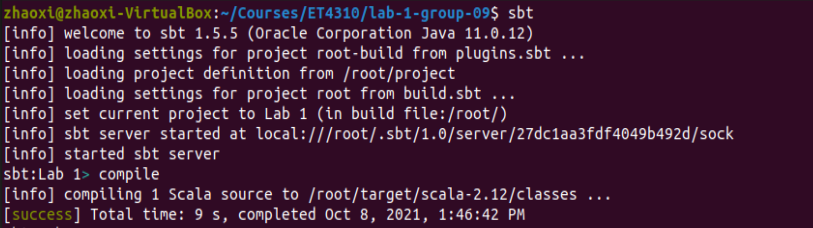
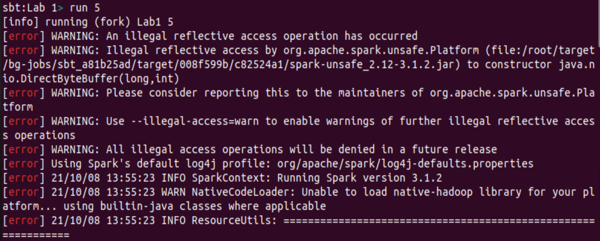
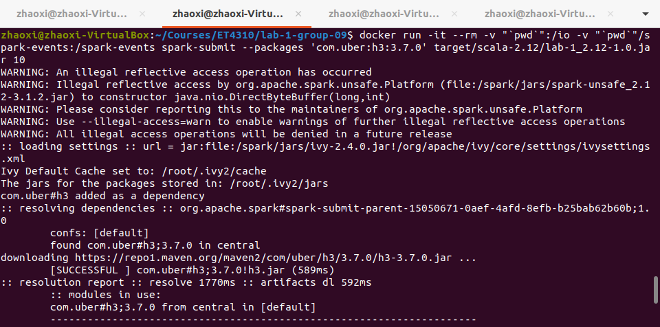
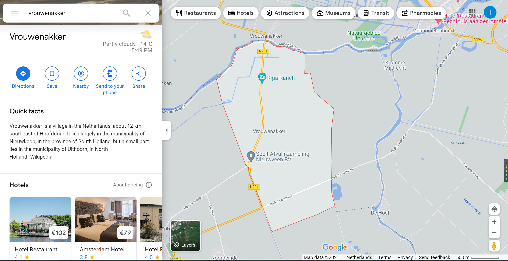
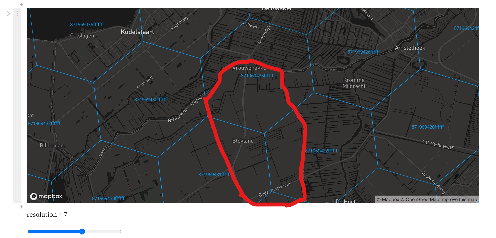
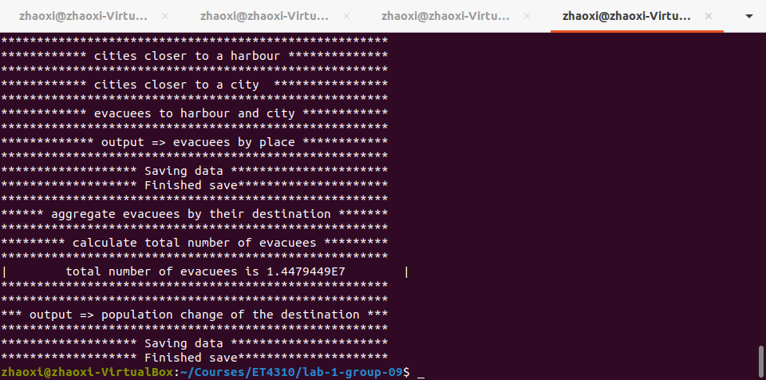
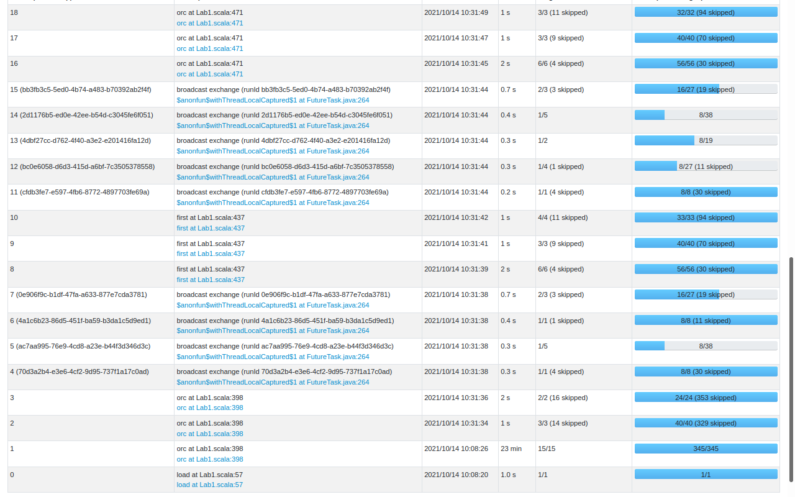
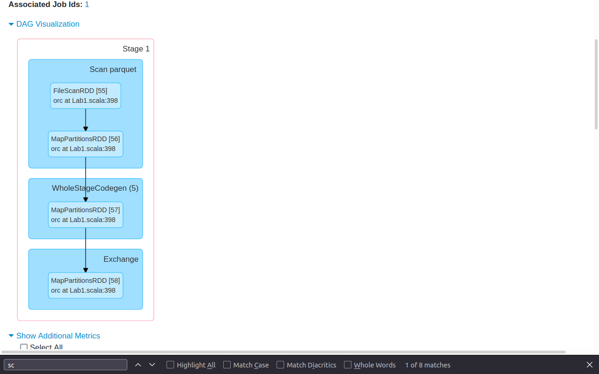

# Lab 1 Report

 


> "More people died in the struggle against water than in the struggle against men." <p align="right">---- Pytheas Massiliensis, 350 BC</p>  

As the Greek geographer noted of the Low Countries, the flood has been a severe issue that haunted people in the Low Land for hundreds of years.  Currently, as shown in the graph on the right side, approximately two-thirds of the land in the Netherlands is below sea level. It is still highly vulnerable to flooding. 

This is the motivation of our work — Assume that all the flood control infrastructures in the Netherlands failed, and the sea level has risen a certain height. Residents living in the flooded areas need to be evacuated into cities above sea level. The goal of our project is to present a relocation plan for this situation.

## Usage
The structure of our project is:

```

├── build.sbt
├── project
│   └── build.properties
└── src
    └── main
        └── scala
            └── Lab1.scala
```

After cloning the repository, navigate to the root directory by typing in the following command in the terminal:

```
cd directory_to_Lab1/lab-1-group-09
```

Then start the sbt container in the root folder; it should start an interactive sbt process. Here, we can compile the sources by writing the compile command.
```
docker run -it --rm -v "`pwd`":/root sbt sbt
sbt:Lab1 >compile
```
<p align="center">

</p>

<h5 align="center"> Running sbt </h5>


Now we are set up to run our program! Consider an integer that represents the height of the rising sea level (unit: meter).<br/>
Use the ` run height `  command to start the process, and you can get information like the image below. This way of running the spark application is mainly used for testing.  
Next, we will introduce another way of building and running this Spark application, enabling developers to inspect the event log on the spark history server.  
```
sbt:Lab1 >run 5
```  

<p align="center">

</p>

<h5 align="center"> testing the application in sbt</h5>


By using the ` spark-submit `  command, we set the application to run on a local Spark "cluster." Since we have already built the JAR, all we need to do is to run the code below:

```
docker run -it --rm -v "`pwd`":/io -v "`pwd`"/spark-events:/spark-events spark-submit --packages 'com.uber:h3:3.7.0' target/scala-2.12/lab-1_2.12-1.0.jar height
```
In which the last argument,` height, `represents the height of sea-level rise. Then we can get information like the below image.

<p align="center">

</p>

<h5 align="center"> running Spark application using spark-submit command </h5>


## Functional overview
### Step 1: Collecting valid data 
  * Raw data are read from OpenStreetMap and grouped by their places. Then, invalid data are filtered out; the remainder is stored into data frame [groupLessDF]. 
  * The H3 resolution we chose for our calculation is 7. Here is our reason:
    * The resolution should be set to a certain level that even the area of a small place could be represented with at least one single H3 tile. (no overlap with other places)
    * Take one of the least populated villages - Vrouwenakker, as an example. The area of the place is about five km^2. From the [Table of Cell Areas for H3 Resolutions](https://h3geo.org/docs/core-library/restable), we can find that a tile area is 5.1612932 km^2 when the resolution is 7, which perfectly matches our example. A more intuitive way of visualizing the relationship between the area of H3 tiles and the village is presented below: 
  ```
   +---------------+----------------+------------+---------------+-----------+---------------+-------------+
   |H3             |place           |num_evacuees|safeH3         |destination|safe_population|city_distance|
   +---------------+----------------+------------+---------------+-----------+---------------+-------------+
   |871969435ffffff|Vrouwenakker    |111         |87196bb26ffffff|Zoetermeer |124780         |13           |
   +---------------+----------------+------------+---------------+-----------+---------------+-------------+
  ``` 
 
<p align="center">

</p>
<h5 align="center"> An example of one of the smallest data point </h5>

<p align="center">

</p>
<h5 align="center"> Visualize the H3 tiles when resolution = 7</h5>
    

    
  
  * After calculating corresponding H3 index values, we get all the information we need in the data frame [h3mapdf]. Since we will re-use [h3mapdf] for the following process, it is stored in memory to get better performance.
  * The data set is divided into two dataframes : [harbourDF] for harbours, [placeDF] for other places.
### Step 2: Aggregating data
  * We defined function ` combineDF ` to combine data from OpenStreetMap and ALOS into [combinedDF]. 
  * Acquired elevation data from ALOS, we can determine whether a place is flooded based on the input ` height `. The results are separated into [floodDF] and [safeDF].
    * Here, the lowest elevation is chosen as the indicator of whether a place should evacuate or not.
    *  Because, across the world, the areas near coasts are the most densely populated and the most vulnerable areas to the rising sea level. Unlike the Grand Canyon, the elevation of these areas would not change drastically.
    *   Our project serves as a warning sign. The goal is to minimize the casualty. If we chose the average elevation, it would be too late for residents living in an area below the average elevation. However, it could be affected by the rising sea level to receive an evacuation plan. 
  * To make the application type-safe, we added the ` Typecheck ` object to indicate the users' correct input type and range. When the input value is incorrect, the program will terminate with a message.
### Step 3: Matching the flooded region to the optimal shelter
  * We defined function ` findClosestDest ` for the following operations. There are two ways of implementing it: 
     1. Match the flooded place with all the safe places and compare the distances
     2. Narrow the search attempts to places within the same large H3 tile
  * [floodToSafe] data frame stores each flooded city and its distances to the nearest safe city and harbour. 
### Step 4: Calculating evacuation plan
  * By comparing the distances to the city and the harbour, we divide the flooded places into two groups, namely:
     *  [near_city] places that are closer to a safe city 
     *  [near_harbour] places that are closer to a harbour.
  * Finally, we calculate the change of population for the plan according to the evacuation rules and output the result as ` .orc ` files.

## Result

When the application finished, information showing on the screen is like this:

<p align = "center" >
 
</p>
<h5 align="center"> Result when height=10 </h5>


Estimated total evacuees:
```
+--------+------------+
|height  |evacuees    |
|10      |14,479,449  |
|20      |15,866,866  |
|30      |16,039,942  |
|50      |16,427,375  |
+--------+------------+
```

Saved data:

```
+------------------------+------------+-----------+
|place                   |num_evacuees|destination|
+------------------------+------------+-----------+
|Aadorp                  |1520.0      |Enschede   |
|Aagtekerke              |1156.5      |Maastricht |
|Aagtekerke              |385.5       |Waterworld |
|Aalden                  |1222.5      |Enschede   |
|Aalden                  |407.5       |Waterworld |
|Aalsmeer                |16626.0     |Enschede   |
|Aalsmeer                |5542.0      |Waterworld |
|Aalsmeerderbrug         |375.75      |Enschede   |
|Aalsmeerderbrug         |125.25      |Waterworld |
|Aalst                   |1576.5      |Maastricht |
|Aalst                   |525.5       |Waterworld |
......

+-----------+--------------+--------------+
|destination|old_population|new_population|
+-----------+--------------+--------------+
|Tilburg    |199128.0      |3945939.25    |
|Eindhoven  |226921.0      |690818.5      |
|Waterworld |0.0           |3061754.0     |
|Enschede   |148874.0      |533033.25     |
|Ede        |72460.0       |4183614.5     |
|Venlo      |64339.0       |230321.25     |
|Apeldoorn  |141107.0      |1282945.5     |
|Maastricht |120105.0      |131383.0      |
|Roermond   |41225.0       |97623.0       |
|Emmen      |56113.0       |1392288.75    |
+-----------+--------------+--------------+
```
## Scalability

The way we implemented the program does not include any non-scalable computation steps.

In step 1, initially, we grouped the data into [groupDF] and then removed invalid data. After analyzing the data in the [groupDF], we found that all the data with a type other than "node" can be removed before the ` groupBy ` transformation. Since it causes a shuffle, it is better to decrease the volume of data before that.  

## Performance

There are totally 18 spark jobs, in which job 1 takes the longest time.
<p align = "center" >
 
</p>

<h5 align="center"> Spark jobs</h5>

In job 1, three stages take longer than others, namely stages 1, 2, and 5. 

<p align = "center" >
 
</p>

<h5 align="center"> Spark stages</h5>

In stage 1, the reason that it takes such a long time is :
1. It reads in a lot of the data from ALOS database
2. A User-defined-function is used to calculate the H3 values. UDFs are a black box to Spark; hence it cannot apply optimization.  
3. A wide transformation is performed to gather the points within the same H3 tile. The ` groupBy ` transformation's output requires reading data from other partitions, combining them, and writing to disk. So it will force a shuffle of data from each of the executor's partitions across the cluster.

<p align = "center" >
 
</p>
<h5 align="center"> Stage 1 DAG </h5>
